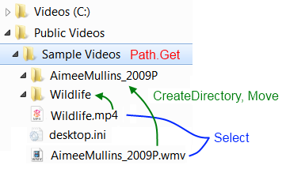

FluentPath
==========

FluentPath implements a modern wrapper around System.IO, using modern patterns
such as fluent APIs and Lambdas.
By using FluentPath instead of System.IO, you'll be able to chain calls and
act on sets of files as if they were individual files.

Getting started
---------------

In order to run the tests for this package, you'll need to have
[SpecFlow](http://www.specflow.org/getting-started/) installed.

Using FluentPath
----------------

This was originally published at http://weblogs.asp.net/bleroy/archive/2010/03/10/fluentpath-a-fluent-wrapper-around-system-io.aspx.

.NET is now more than eight years old, and some of its APIs got old with more
grace than others.
System.IO in particular has always been a little awkward.
It’s mostly static method calls (Path.\*, Directory.\*, etc.) and some stateful
classes (DirectoryInfo, FileInfo).
In these APIs, paths are plain strings.

Since .NET v1, lots of good things happened to C#: lambda expressions,
extension methods, optional parameters to name just a few.
Outside of .NET, other interesting things happened as well.
For example, you might have heard about this JavaScript library that had some
success introducing a fluent API to handle the hierarchical structure of the
HTML DOM.
You know? jQuery.

Knowing all that, every time I need to use the stuff in System.IO, I cringe.
So I thought I’d just build a more modern wrapper around it.
I used a fluent API based on an essentially immutable Path type and an
enumeration of such path objects.
To achieve the fluent style, a healthy dose of lambda expressions is being used
to act on the objects.

Without further ado, here’s an example of what you can do with the new API.
In that example, I’m using a Media Center extension that wants all video files
to be in their own folder.
For that, I need a small tool that creates directories for each video file and
moves the files in there. Here’s the code for it:

```csharp
Path.Get(args.Length != 0 ? args[0] : ".")
    .Files(
        p => new[] {
            ".avi", ".m4v", ".wmv",
            ".mp4", ".dvr-ms", ".mpg", ".mkv"
        }.Contains(p.Extension))
    .CreateDirectories(
        p => p.Parent()
              .Combine(p.FileNameWithoutExtension))
    .End()
    .Move(
        p => p.Parent()
              .Combine(p.FileNameWithoutExtension)
              .Combine(p.FileName));
```

This code creates a Path object pointing at the path pointed to by the first
command line argument of my executable.
It then selects all video files.
After that, it creates directories that have the same names as each of the
files, but without their extension.
The result of that operation is the set of created directories.
We can now get back to the previous set using the Previous method, and finally
we can move each of the files in the set to the corresponding freshly created
directory, whose name is the combination of the parent directory and the
filename without extension.



The new fluent path library covers a fair part of what’s in System.IO in a
single, convenient API.
Check it out, I hope you’ll enjoy it.
Suggestions and contributions are more than welcome.
